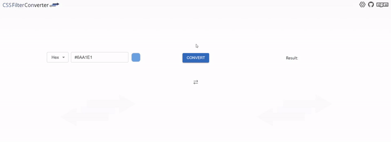
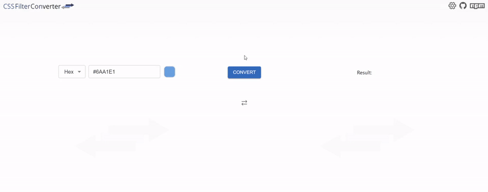

 
    

## Description

CSS Filter Converter is a simple tool used for converting basic css color formats to and from css filter. It can be accessed through a dedicated [website](https://cssfilterconverter.com) or directly injected into your project via [NPM](https://npmjs.com/package/css-filter-converter).

## Features

### Supported formats

|             | Hex | RGB | HSL | Keyword |
| ----------- | :-: | :-: | :-: | :-----: |
| To filter   |  ✓  |  ✓  |  ✓  |    ✓    |
| From filter |  ✓  |  ✓  |  ✓  |    ✗    |

### Icon Mode

Filter css property can be used to set the color of your SVG images. Icon Mode panel allows you to upload your SVG images directly into this tool and immediately apply the result filter css value to them (This tool operates locally on your browser and no data leaves the privacy of your computer):

    

### Sheen

In practice, filter css property is used to edit the color properties of the element that it is applied to, but it will not completely override the existing colors. This behaviour can sometimes make it difficult to apply a consistent mono color for the underlying contents, leaving an undesirable partial color change effect that is especially evident in SVG images. The Sheen option is used to reinforce the application of the filter color by prepending the following properties <b>'brightness(0) saturate(100%)'</b> that will always result in a well saturated single hue color:

    

## More information

- [Website](https://github.com/OvidijusParsiunas/css-filter-converter/tree/main/website)
- [NPM](https://github.com/OvidijusParsiunas/css-filter-converter/tree/main/npm)

## Contributions

Open source is built by the community for the community. All contributions to this project are welcome!
  Additionally, if you have any suggestions for enhancements, ideas on how to take the project further or have discovered a bug, do not hesitate to create a new issue ticket and we will look into it as soon as possible!
