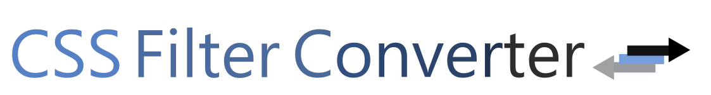

<p align="center"> 
    
</p>

<div align="center">
    <a href="https://img.shields.io/github/actions/workflow/status/OvidijusParsiunas/css-filter-converter/push-to-main-branch-deploy-gh-pages.yml?branch=main">
        
    </a><a href="https://img.shields.io/bundlephobia/min/css-filter-converter">
        
    </a><a href="https://img.shields.io/npm/v/css-filter-converter">
        
    </a>
</div>

## Description

CSS Filter Converter is a simple tool used for converting basic css color formats to and from css filter.

## Installation

```
npm install css-filter-converter
```

If you want the capability to convert from filter to a basic color, please additionally install puppeteer by running the following command:

```
npm install puppeteer
```

## How to use

```js
import CssFilterConverter from 'css-filter-converter';

// converting from basic color to filter
const result = CssFilterConverter.hexToFilter('#69A1DE');

// converting from filter to basic color
CssFilterConverter.filterToHex('brightness(0) saturate(100%) invert(58%) sepia(55%) saturate(365%) hue-rotate(171deg) brightness(93%) contrast(98%)').then((result) => result);

const result = await CssFilterConverter.filterToHex('brightness(0) saturate(100%) invert(58%) sepia(55%) saturate(365%) hue-rotate(171deg) brightness(93%) contrast(98%)');
```

## API

### Color to filter

```js
// hex
hexToFilter('#69A1DE');
hexToFilter('#69A');

// rgb
rgbToFilter('rgb(106, 161, 225)');
rgbToFilter('106 161 225');

// hsl
hslToFilter('hsl(212deg, 66%, 65%)');
hslToFilter('212 66 65');

// keyword
keywordToFilter('blue');
// Full list of valid keyword values can be viewed in the following link: https://github.com/colorjs/color-name/blob/master/index.js 
```

Options:
| Name | Values | Default value | Description |
| :---------: | :-: | :-: | :- |
| sheen  |  true/false | true  | Reinforces the strength of resultant filter color by prepending the following properties 'brightness(0) saturate(100%)'. Recommended to leave enabled for SVG images. |

```js
hexToFilter('#69A1DE', { sheen: false });
```

Result object:
| Property Name | Nested Property | Type | Description |
| :---------: | :-:  | :-:  | :- |
| color | - |  string  | Css filter value.  |
| loss | - | number  | Every execution of color to filter conversion will result in a slightly different color value due to the randomization used in the filter value generation process. This will cause some results to be more further away from the input color than others, which is quantified by the loss value.    |
| error | message | string  | This library does not throw runtime errors and instead populates the error key with an object containing a message property that describes the reason for the error occurance.   |

```js
const result = hexToFilter('#69A1DE');
// { color: 'brightness(0) saturate(100%) invert(58%) sepia(55%) saturate(365%) hue-rotate(171deg) brightness(93%) contrast(98%)', loss: 0.99, error: null }
```

### Filter to color

```js
const filterString = 'brightness(0) saturate(100%) invert(58%) sepia(55%) saturate(365%) hue-rotate(171deg) brightness(93%) contrast(98%)';

// hex
filterToHex(filterString);

// rgb
filterToRgb(filterString);

// hsl
filterToHsl(filterString);

// conversion from filter is asynchronous and the result can be accessed in one of the following ways:

const result = await filterToHex(filterString);

CssFilterConverter.filterToHex(filterString).then((result) => {});
```

Options:
| Name | Values | Default value | Colors | Description |
| :---------: | :-: | :-: | :-: | :- |
| resultType  |  'array'/'string' | 'array'  | RGB/HSL | Returns either an array or a formatted string. |

```js
const stringResult = await filterToRgb(filterString, { resultType: 'array' });
// { color: [125, 125, 125] }

const arrayResult = await filterToRgb(filterString, { resultType: 'string' });
// { color: 'rgb(125, 125, 125)' }
```

Result object:
| Property Name | Nested Property | Type | Description |
| :---------: | :-:  | :-:  | :- |
| color | - |  string/array  | Color result. Value type is dependent on the color type or the 'resultType' option value. |
| error | message | string  | This library does not throw runtime errors and instead populates the error key with an object containing a message property that describes the reason for the error occurance.   |

```js
const result = await filterToHex(filterString);
// { color: '#6AA1E1', error: null }
```

## Local setup

```
# Requirements: Node version 8+ and NPM version 6+

# Install node dependencies:
$ npm install

# Execute index.ts code directly:
$ npm run execute

# Transpile on save:
$ npm run watch

# Run tests:
$ npm run test
```

## Contributions

Open source is built by the community for the community. All contributions to this project are welcome!
<br> Additionally, if you have any suggestions for enhancements, ideas on how to take the project further or have discovered a bug, do not hesitate to create a new issue ticket and we will look into it as soon as possible!
